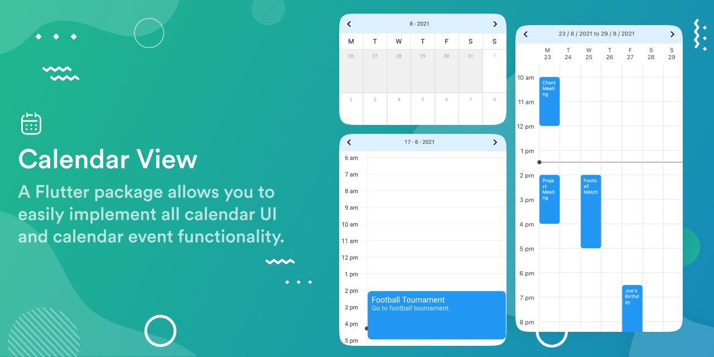

# calendar_view

[](https://github.com/SimformSolutionsPvtLtd/flutter_calendar_view/actions) [](https://pub.dev/packages/calendar_view)


A Flutter package allows you to easily implement all calendar UI and calendar event functionality.

For web demo visit [Demo](https://simformsolutionspvtltd.github.io/flutter_calendar_view/).

## Installing

1. Add dependencies to `pubspec.yaml`

    Get the latest version in the 'Installing' tab on [pub.dev](https://pub.dev/)

    ```yaml
    dependencies:
        calendar_view: <latest-version>
    ```

2. Run pub get.
   
   ```shell
   flutter pub get
   ```

2. Import package.

    ```dart
    import 'package:calendar_view/calendar_view.dart';

    ```

## Implementation

1. Initialize `EventController`

    Make sure that you use same generic type on controller and views

    ```dart
    final controller = EventController<String>(); 
    ```

2. Initialize GlobalKeys.(Optional)

    - For `Month View`:

    ```dart
    final monthViewKey = GlobalKey<MonthViewState>();
    ```

    - For `Day View`:

    ```dart
    final dayViewKey = GlobalKey<DayViewState>();
    ```

    - For `Week View`:

    ```dart
    final weekViewKey = GlobalKey<WeekViewState>();
    ```

3. Add calendar views (key is optional).

    Make sure that you use same generic type on controller and views

    - For Month View

    ```dart
    MonthView<String>(
        key: monthViewKey,
        controller: controller,
    );
    ```

    - For Day View

    ```dart
    DayView<String>(
        key: dayViewKey,
        controller: controller,
    );
    ```

    - For Week view

    ```dart
    WeekView<String>(
        key: weekViewKey,
        controller: controller,
    );
    ```

    For more info on parameters visit [documentation](#).

4. Use `controller` to add or remove events.

    - Add event:

    ```dart
    final event = CalendarEventData<String>(
        date: DateTime(2021, 8, 10);
        event: "Event 1", // Generic type String. You can use complex models as well.
    );

    controller.add(event);

    // Use controller.addAll(); to add multiple events.
    ```

    - Remove event:

    ```dart
    controller.remove(event);
    ```

    As soon as you add or remove events for controller it will automatically update view assigned to that controller. See, [Use of EventController](#use-of-eventcontroller) for more info

5. Use `GlobalKey` to change the page or jump to specific page or date. See, [Use of GlobalKey](#use-of-globalkey) for more info.

## How to Use

### Use of `EventController`

`EventController` is used for adding or removing events from calendar. When we add or remove events from controller, it will automatically update all the view to which this controller is assigned.

If you are using all three views in your project and want to synchronize events between them, then pass same `controller` object to all views.

Methods provided by `EventController`

| Name           | Parameters | Description |
|----------------|-----------|--------------|
| add            |CalendarEventData\<T\> event | Adds one event in controller and rebuilds view. |
| addAll         | List\<CalendarEventData\<T\>\> events | Adds list of events in controller and rebuilds view. |
| remove         | CalendarEventData\<T\> event | Removes an event from controller and rebuilds view. |
| getEventsOnDay | DateTime date | Returns list of events on `date` |

### Use of `GlobalKey`

User needs to define keys to access functionalities like changing a page or jump to a specific page or date.

User needs to define `GlobalKey<MonthViewState>`, `GlobalKey<DayViewState>` and `GlobalKey<WeekViewState>` for month view, day view and week view respectively. By assigning these keys to Views you can access methods defined by State class of respected views.

Methods defined by `MonthViewState` class:

| Name | Parameters | Description |
|------|------------|-------------|
| nextPage | none | Jumps to next page. |
| previousPage | none | Jumps to previous page. |
| jumpToPage | int page | Jumps to page index defined by `page`. |
| animateToPage | int page | Animate to page index defined by `page`. |
| jumpToMonth | DateTime month | Jumps to page that has calendar for month defined `month` |
| animateToMonth | DateTime month | Animate to page that has calendar for month defined by `month` |

Methods defined by `DayViewState` class.

| Name | Parameters | Description |
|------|------------|-------------|
| nextPage | none | Jumps to next page. |
| previousPage | none | Jumps to previous page. |
| jumpToPage | int page | Jumps to page index defined by `page`. |
| animateToPage | int page | Animate to page index defined by `page`. |
| jumpToDate | DateTime date | Jumps to page that has calendar for month defined `date` |
| animateToDate | DateTime date | Animate to page that has calendar for month defined by `date` |

Methods defined by `WeekViewState` class.

| Name | Parameters | Description |
|------|------------|-------------|
| nextPage | none | Jumps to next page. |
| previousPage | none | Jumps to previous page. |
| jumpToPage | int page | Jumps to page index defined by `page`. |
| animateToPage | int page | Animate to page index defined by `page`. |
| jumpToWeek | DateTime week | Jumps to page that has calendar for month defined `week` |
| animateToWeek | DateTime week | Animate to page that has calendar for month defined by `week` |


## License

```
MIT License

Copyright (c) 2021 Simform Solutions

Permission is hereby granted, free of charge, to any person obtaining a copy
of this software and associated documentation files (the "Software"), to deal
in the Software without restriction, including without limitation the rights
to use, copy, modify, merge, publish, distribute, sublicense, and/or sell
copies of the Software, and to permit persons to whom the Software is
furnished to do so, subject to the following conditions:

The above copyright notice and this permission notice shall be included in all
copies or substantial portions of the Software.

THE SOFTWARE IS PROVIDED "AS IS", WITHOUT WARRANTY OF ANY KIND, EXPRESS OR
IMPLIED, INCLUDING BUT NOT LIMITED TO THE WARRANTIES OF MERCHANTABILITY,
FITNESS FOR A PARTICULAR PURPOSE AND NONINFRINGEMENT. IN NO EVENT SHALL THE
AUTHORS OR COPYRIGHT HOLDERS BE LIABLE FOR ANY CLAIM, DAMAGES OR OTHER
LIABILITY, WHETHER IN AN ACTION OF CONTRACT, TORT OR OTHERWISE, ARISING FROM,
OUT OF OR IN CONNECTION WITH THE SOFTWARE OR THE USE OR OTHER DEALINGS IN THE
SOFTWARE.

```